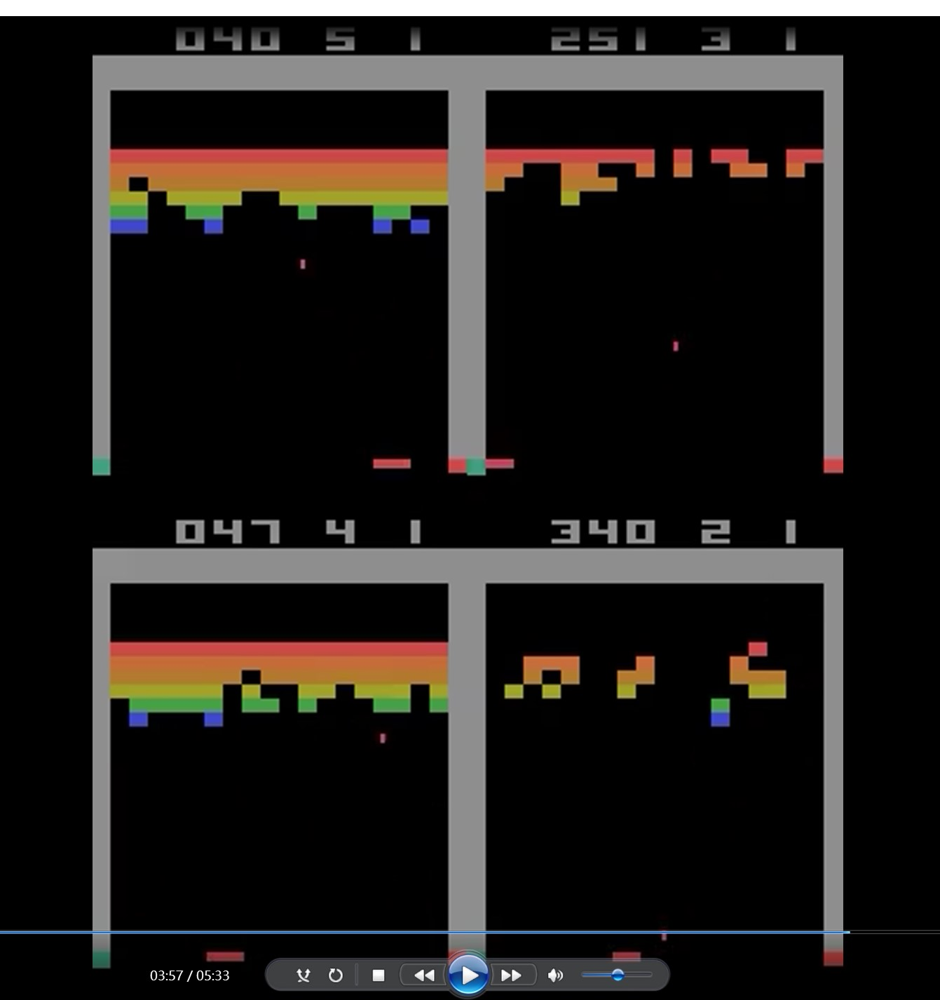
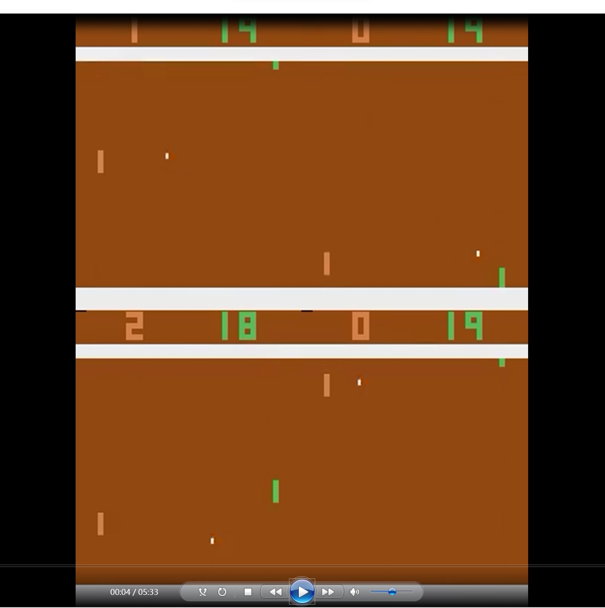

### Reinforcement in Games with DuelingDQN and PPO

This repository contains an implementation of Dueling Deep Q-Networks (DuelingDQN) and Proximal Policy Optimization (PPO) algorithms applied to different reinforcement learning environments. The DuelingDQN was used for Atari game environments, namely `PongNoFrameskip-v4` and `BreakoutNoFrameskip-v4`, while the PPO was employed for `Hopper-v3` and `Ant-v3` environments in the MuJoCo simulator.

#### Requirements
This codebase runs on Python 3.10 and requires PyTorch, Gym, Atari and Mujoco. You can install the requirements via:

```bash
pip install torch gym mujoco_py
```

Please note that installing Mujoco requires a separate process. Follow instructions [here](https://github.com/openai/mujoco-py).

#### Usage 
You can run the code by executing `run.py`:
```bash
python run.py --env_name [env_name] --agent_type [agent_type] --mode [train type]
```
Here is an explanation of the command line arguments:

* `--env_name`: Specifies the gym environment. Options are `PongNoFrameskip-v4`, `BreakoutNoFrameskip-v4`, `Hopper-v3`, `Ant-v3`.
* `--agent_type`: The agent type. Options are `DuelingDQN`, `PPO`.
* `--episodes`: Number of episodes to run. Default is 10.
* `--seed`: Random seed for reproducibility. Default is 0.
* `--mode`: The mode of operation. Options are `train+test`, `test`. Default is `test`.

#### Example
To train a DuelingDQN agent on Pong:
```bash
python main.py --env_name "PongNoFrameskip-v4" --agent_type "DuelingDQN" --mode "train+test" --episodes 1000
```
To test a pre-trained PPO agent on Ant:
```bash
python main.py --env_name "Ant-v3" --agent_type "PPO" --mode "test"
```
Please modify the above text to accurately reflect your project and its requirements.

#### Models
I have trained models for each game environment and stored them in the `./models` directory. These models can be called directly for testing by setting the `mode` as `test`.

#### Videos
The recorded video will be stored in the ./video directory, or you can directly access to view my recorded video.



